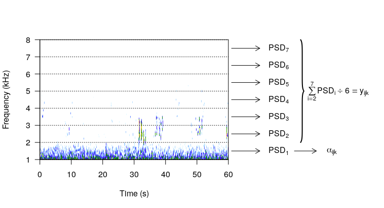

```{r setup, include=FALSE}
knitr::opts_chunk$set(echo = FALSE)
library(knitr)
```

# Outline

+ Motivation/Objectives
+ Methods: recordings and sound quantification
+ Model Development
+ Results: model assessment, soundscape maps, implications

# Introduction

+ Road effect
+ Impact of road noise on soundscapes/organisms
+ Spatio-temporal trends of biophony and technophony
+ Identifying technophony "hot spots"

# Study Questions/Objectives

+ What is the functional relationship between biophony and technophony in western NY soundscapes? 
+ Can public traffic data explain the variability in technophony? 
+ Develop statistically valid soundscape maps with accompanying uncertainty. 

# Study Location and Data Collection

+ 9 western NY forest plots, 18 recording sites 
+ 29 minute recordings (morning, afternoon, evening) 
+ 3 times of day x 18 recording sites x 29 one-minute segments = 1566 one minute sound bites

# Soundscape Quantification

+ Power Spectral Density [@welch1967; @ndsi]

```{r, echo = FALSE, out.width = "4.5in", out.height = "2.5in"}

```

# Road Influence Quantification

1. Average annual daily traffic (AADT) 
2. Average speed 
3. Distance of recording site to road 
4. Shape of road 

\begin{center}
    $\text{RC}_i = $ $\frac{\text{log($\frac{\text{AADT}}{100}$) + log(speed) - log(distance)}}{100}$
\end{center}

where $RC_i$ is the road covariate for a road pixel within 600 m of the recording site (NYS DOT, NYS GIS Clearinghouse). 

# Sample Region in western NY

\begin{figure}
\centering
    \subcaptionbox{}{\includegraphics[width=5cm]{images/nysRoads.png}\label{fig:nysRoads}}%
    \subcaptionbox{}{\includegraphics[width=5cm]{images/roadCovariateRoads.png}}\label{fig:roadCovariateRoads}%
    \caption{Distribution of roads in New York State. (a) Public road data is displayed across all of NYS. (b) The road covariate is computed at a 30 $\times$ 30 m resolution for the boxed area.}
    \label{fig:roads}
\end{figure}

# Data

```{r, echo = FALSE, fig.height = 5.5}
techno <- read.table("~/Dropbox/DHF19/beta/data/alpha")[, 1]
bio <- read.table("~/Dropbox/DHF19/beta/data/beta")[, 1]
rc <- read.table("~/Dropbox/DHF19/beta/data/roadCovariate")[, 1]

par(mfrow = c(1, 2))
plot(rc, techno, axes=F, ylim=range(techno),
     xlab="Road Covariate", ylab="Technophony", cex.lab = 1.5, pch = 19, cex = 0.5)
axis(1)
axis(2)
plot(techno, bio, axes = F, ylim = range(bio), xlab = "Technophony", 
     ylab = "Biophony", cex.lab = 1.5, pch = 19, cex = 0.5)
axis(1)
axis(2)
```

# Complexities with Soundscape Data

1. Multivariate (biophony and technophony)
2. non-Gaussian 
3. non-linear 
4. non-stationary 
5. Highly correlated 


# Modeling Solutions

+ Basic idea: Generalized Linear Model 
+ Hierarchical Bayesian framework $\rightarrow$ very flexible \pause
1. Multivariate (biophony and technophony) $\rightarrow$ two-stage model \pause
2. non-Gaussian $\rightarrow$ beta regression \pause
3. non-linear $\rightarrow$ cubic b-splines \pause
4. non-stationary $\rightarrow$ AR(1) covariance structure on residuals \pause
5. Highly correlated $\rightarrow$ AR(1) covariance structure 

<!-- # Bayesian Network: Stage 1, Model 1 -->

<!-- \begin{figure}[!h] -->
<!-- \centering -->
<!-- \begin{tikzpicture} -->
<!-- \tikzstyle{decision} = [diamond, draw, fill=blue!20, text width=2em, text badly centered, node distance=1cm, inner sep=0pt] -->
<!-- \tikzstyle{block} = [rectangle, draw, fill=blue!20, text width=4em, text centered, rounded corners, minimum height=2em] -->
<!-- \tikzstyle{line} = [draw, -latex'] -->
<!-- \tikzstyle{dashline} = [draw, dashed, -latex'] -->
<!-- \tikzstyle{cloud} = [draw, ellipse,fill=red!20, node distance=3cm,minimum height=2em] -->
<!-- \tikzstyle{textNames} = [rectangle, draw, text width=7em, text centered, rounded corners, minimum height=2em] -->
<!-- % Place nodes -->
<!-- \node [cloud] (covariates) {$x$}; -->
<!-- \node [block, below of = covariates, node distance = 1.5 cm] (alpha) {$\boldsymbol{\alpha}$}; -->
<!-- \path [dashline] (alpha) -- (covariates);  -->
<!-- \node [block, below right of = alpha, node distance = 3.5 cm] (measurementError1) {$\phi_{\alpha}$};  -->
<!-- \path [line] (measurementError1) -- (alpha);  -->
<!-- \node [block, below of = alpha, node distance = 2.5 cm] (randomEffects) {$\boldsymbol{\omega}$}; -->
<!-- \path [line] (randomEffects) -- (alpha); -->
<!-- \node [block, left of = randomEffects, node distance = 2.5 cm] (beta) {$\boldsymbol{\beta_{\alpha}}$}; -->
<!-- \path [line] (beta) -- (alpha);  -->
<!-- \node [block, below left of = randomEffects, node distance = 2cm] (rho) {$\rho_{\alpha}$}; -->
<!-- \path [line] (rho) -- (randomEffects);  -->
<!-- \node [block, below right of = randomEffects, node distance = 2cm] (sigma) {$\sigma_{\alpha}^2$}; -->
<!-- \path [line] (sigma) -- (randomEffects); -->
<!-- \node [textNames, right of = covariates, node distance = 5cm] (data) {Data}; -->
<!-- \node [textNames, right of = alpha, node distance = 5cm] (process) {Process}; -->
<!-- \node [textNames, right of = randomEffects, node distance = 5cm] (parameters) {Parameters}; -->
<!-- \node [textNames, right of = sigma, node distance = 3.62cm] (hyperParams) {Hyperparameters}; -->
<!-- \end{tikzpicture} -->
<!-- \end{figure} -->

<!-- # Bayesian Network: Stage 2, Model 1 -->

<!-- \begin{figure}[!h] -->
<!-- \centering -->
<!-- \begin{tikzpicture} -->
<!-- \tikzstyle{decision} = [diamond, draw, fill=blue!20, text width=2em, text badly centered, node distance=1cm, inner sep=0pt] -->
<!-- \tikzstyle{block} = [rectangle, draw, fill=blue!20, text width=4em, text centered, rounded corners, minimum height=2em] -->
<!-- \tikzstyle{line} = [draw, -latex'] -->
<!-- \tikzstyle{dashline} = [draw, dashed, -latex'] -->
<!-- \tikzstyle{cloud} = [draw, ellipse,fill=red!20, node distance=3cm,minimum height=2em] -->
<!-- \tikzstyle{textNames} = [rectangle, draw, text width=7em, text centered, rounded corners, minimum height=2em] -->
<!-- % Place nodes -->
<!-- \node [block] (covariates) {$\hat{\boldsymbol{\alpha}}$}; -->
<!-- \node [block, left of = covariates, node distance = 2.45 cm] (alpha) {$\boldsymbol{y}$}; -->
<!-- \path [line] (alpha) -- (covariates);  -->
<!-- \node [block, below right of = alpha, node distance = 3.5 cm] (measurementError1) {$\phi_{y}$};  -->
<!-- \path [line] (measurementError1) -- (alpha);  -->
<!-- \node [block, below of = alpha, node distance = 2.5 cm] (randomEffects) {$\boldsymbol{\nu}$}; -->
<!-- \path [line] (randomEffects) -- (alpha); -->
<!-- \node [block, left of = randomEffects, node distance = 2.5 cm] (beta) {$\boldsymbol{\beta_{y}}$}; -->
<!-- \path [line] (beta) -- (alpha);  -->
<!-- \node [block, below left of = randomEffects, node distance = 2cm] (rho) {$\rho_{y}$}; -->
<!-- \path [line] (rho) -- (randomEffects);  -->
<!-- \node [block, below right of = randomEffects, node distance = 2cm] (sigma) {$\sigma_{y}^2$}; -->
<!-- \path [line] (sigma) -- (randomEffects); -->
<!-- \node [textNames, right of = alpha, node distance = 5cm] (process) {Process}; -->
<!-- \node [textNames, right of = randomEffects, node distance = 5cm] (parameters) {Parameters}; -->
<!-- \node [textNames, right of = sigma, node distance = 3.62cm] (hyperParams) {Hyperparameters}; -->
<!-- \end{tikzpicture} -->
<!-- \end{figure} -->

<!-- # Bayesian Network: Stage 1, Model 2 -->

<!-- \begin{figure}[!h] -->
<!-- \centering -->
<!-- \begin{tikzpicture} -->
<!-- \tikzstyle{decision} = [diamond, draw, fill=blue!20, text width=2em, text badly centered, node distance=1cm, inner sep=0pt] -->
<!-- \tikzstyle{block} = [rectangle, draw, fill=blue!20, text width=4em, text centered, rounded corners, minimum height=2em] -->
<!-- \tikzstyle{line} = [draw, -latex'] -->
<!-- \tikzstyle{dashline} = [draw, dashed, -latex'] -->
<!-- \tikzstyle{cloud} = [draw, ellipse,fill=red!20, node distance=3cm,minimum height=2em] -->
<!-- \tikzstyle{textNames} = [rectangle, draw, text width=7em, text centered, rounded corners, minimum height=2em] -->
<!-- % Place nodes -->
<!-- \node [cloud] (covariates) {$x$}; -->
<!-- \node [block, below of = covariates, node distance = 1.5 cm] (alpha) {$\boldsymbol{\alpha}$}; -->
<!-- \path [dashline] (alpha) -- (covariates);  -->
<!-- \node [block, below right of = alpha, node distance = 3.5 cm] (measurementError1) {$\phi_{\alpha}$};  -->
<!-- \path [line] (measurementError1) -- (alpha);  -->
<!-- \node [block, below of = alpha, node distance = 2.5 cm] (randomEffects) {$\boldsymbol{\omega}$}; -->
<!-- \path [line] (randomEffects) -- (alpha); -->
<!-- \node [block, left of = randomEffects, node distance = 2.5 cm] (beta) {$\boldsymbol{\beta_{\alpha}}$}; -->
<!-- \path [line] (beta) -- (alpha);  -->
<!-- \node [block, below left of = randomEffects, node distance = 2cm] (rho) {$\rho_{\alpha}$}; -->
<!-- \path [line] (rho) -- (randomEffects);  -->
<!-- \node [block, below right of = randomEffects, node distance = 2cm] (sigma) {$\boldsymbol{\lambda}_{\alpha}$}; -->
<!-- \path [line] (sigma) -- (randomEffects); -->
<!-- \node [textNames, right of = covariates, node distance = 5cm] (data) {Data}; -->
<!-- \node [textNames, right of = alpha, node distance = 5cm] (process) {Process}; -->
<!-- \node [textNames, right of = randomEffects, node distance = 5cm] (parameters) {Parameters}; -->
<!-- \node [textNames, right of = sigma, node distance = 3.62cm] (hyperParams) {Hyperparameters}; -->
<!-- \end{tikzpicture} -->
<!-- \end{figure} -->

<!-- # Bayesian Network: Stage 2, Model 2 -->

<!-- \begin{figure}[!h] -->
<!-- \centering -->
<!-- \begin{tikzpicture} -->
<!-- \tikzstyle{decision} = [diamond, draw, fill=blue!20, text width=2em, text badly centered, node distance=1cm, inner sep=0pt] -->
<!-- \tikzstyle{block} = [rectangle, draw, fill=blue!20, text width=4em, text centered, rounded corners, minimum height=2em] -->
<!-- \tikzstyle{line} = [draw, -latex'] -->
<!-- \tikzstyle{dashline} = [draw, dashed, -latex'] -->
<!-- \tikzstyle{cloud} = [draw, ellipse,fill=red!20, node distance=3cm,minimum height=2em] -->
<!-- \tikzstyle{textNames} = [rectangle, draw, text width=7em, text centered, rounded corners, minimum height=2em] -->
<!-- % Place nodes -->
<!-- \node [block] (covariates) {$\hat{\boldsymbol{\alpha}}$}; -->
<!-- \node [block, left of = covariates, node distance = 2.45 cm] (alpha) {$\boldsymbol{y}$}; -->
<!-- \path [line] (alpha) -- (covariates);  -->
<!-- \node [block, below right of = alpha, node distance = 3.5 cm] (measurementError1) {$\phi_{y}$};  -->
<!-- \path [line] (measurementError1) -- (alpha);  -->
<!-- \node [block, below of = alpha, node distance = 2.5 cm] (randomEffects) {$\boldsymbol{\nu}$}; -->
<!-- \path [line] (randomEffects) -- (alpha); -->
<!-- \node [block, left of = randomEffects, node distance = 2.5 cm] (beta) {$\boldsymbol{\beta_{y}}$}; -->
<!-- \path [line] (beta) -- (alpha);  -->
<!-- \node [block, below left of = randomEffects, node distance = 2cm] (rho) {$\rho_{y}$}; -->
<!-- \path [line] (rho) -- (randomEffects);  -->
<!-- \node [block, below right of = randomEffects, node distance = 2cm] (sigma) {$\boldsymbol{\lambda}_{y}$}; -->
<!-- \path [line] (sigma) -- (randomEffects); -->
<!-- \node [textNames, right of = alpha, node distance = 5cm] (process) {Process}; -->
<!-- \node [textNames, right of = randomEffects, node distance = 5cm] (parameters) {Parameters}; -->
<!-- \node [textNames, right of = sigma, node distance = 3.62cm] (hyperParams) {Hyperparameters}; -->
<!-- \end{tikzpicture} -->
<!-- \end{figure} -->

# Stage 1: Technophony vs. Road Covariate

Basic Form of Technophony ($\boldsymbol{\alpha}$) $\rightarrow$ Mean: $\boldsymbol{\beta}_{\alpha} \boldsymbol{Z}_{x} + \boldsymbol{w}$; Variance: $\frac{1}{\phi_{\alpha}}$

\begin{figure}[!h]
\centering
\begin{tikzpicture}
\tikzstyle{decision} = [diamond, draw, fill=blue!20, text width=2em, text badly centered, node distance=1cm, inner sep=0pt]
\tikzstyle{block} = [rectangle, draw, fill=blue!20, text width=4em, text centered, rounded corners, minimum height=2em]
\tikzstyle{line} = [draw, -latex']
\tikzstyle{dashline} = [draw, dashed, -latex']
\tikzstyle{cloud} = [draw, ellipse,fill=red!20, node distance=3cm,minimum height=2em]
\tikzstyle{textNames} = [rectangle, draw, text width=7em, text centered, rounded corners, minimum height=2em]
% Place nodes
\node [cloud] (covariates) {$x$};
\node [block, below left of = covariates, node distance = 2.5 cm] (alpha) {$\boldsymbol{\alpha}$};
\path [dashline] (alpha) -- (covariates); 
\node [block, below right of = alpha, node distance = 2.8 cm] (measurementError1) {$\phi_{\alpha}$}; 
\path [dashline] (measurementError1) -- (covariates);
\path [line] (measurementError1) -- (alpha); 
\node [block, below of = alpha, node distance = 2 cm] (randomEffects) {$\boldsymbol{\omega}$};
\path [line] (randomEffects) -- (alpha);
\node [block, left of = randomEffects, node distance = 2 cm] (beta) {$\boldsymbol{\beta_{\alpha}}$};
\path [line] (beta) -- (alpha); 
\node [block, below left of = randomEffects, node distance = 2cm] (rho) {$\rho_{\alpha}$};
\path [line] (rho) -- (randomEffects); 
\node [block, below right of = randomEffects, node distance = 2cm] (sigma) {$\boldsymbol{\lambda}_{\alpha}$};
\path [line] (sigma) -- (randomEffects);
\node [textNames, right of = covariates, node distance = 3.25cm] (data) {Data};
\node [textNames, right of = alpha, node distance = 5cm] (process) {Process};
\node [textNames, right of = randomEffects, node distance = 5cm] (parameters) {Parameters};
\node [textNames, right of = sigma, node distance = 3.62cm] (hyperParams) {Hyperparameters};
\end{tikzpicture}
\end{figure}

# Stage 2: Biophony vs. Technophony

Basic Form of Biophony ($\boldsymbol{y}$) $\rightarrow$ Mean: $\boldsymbol{\beta}_{y} \boldsymbol{Z}_{\hat{\alpha}} + \boldsymbol{\nu}$; Variance: $\frac{1}{\phi_{y}}$

\begin{figure}[!h]
\centering
\begin{tikzpicture}
\tikzstyle{decision} = [diamond, draw, fill=blue!20, text width=2em, text badly centered, node distance=1cm, inner sep=0pt]
\tikzstyle{block} = [rectangle, draw, fill=blue!20, text width=4em, text centered, rounded corners, minimum height=2em]
\tikzstyle{line} = [draw, -latex']
\tikzstyle{dashline} = [draw, dashed, -latex']
\tikzstyle{cloud} = [draw, ellipse,fill=red!20, node distance=3cm,minimum height=2em]
\tikzstyle{textNames} = [rectangle, draw, text width=7em, text centered, rounded corners, minimum height=2em]
% Place nodes
\node [block] (covariates) {$\hat{\boldsymbol{\alpha}}$};
\node [block, left of = covariates, node distance = 2.45 cm] (alpha) {$\boldsymbol{y}$};
\path [line] (alpha) -- (covariates); 
\node [block, below right of = alpha, node distance = 3.5 cm] (measurementError1) {$\phi_{y}$}; 
\path [line] (measurementError1) -- (alpha); 
\path [line] (measurementError1) -- (covariates);
\node [block, below of = alpha, node distance = 2.5 cm] (randomEffects) {$\boldsymbol{\nu}$};
\path [line] (randomEffects) -- (alpha);
\node [block, left of = randomEffects, node distance = 2.5 cm] (beta) {$\boldsymbol{\beta_{y}}$};
\path [line] (beta) -- (alpha); 
\node [block, below left of = randomEffects, node distance = 2cm] (rho) {$\rho_{y}$};
\path [line] (rho) -- (randomEffects); 
\node [block, below right of = randomEffects, node distance = 2cm] (sigma) {$\boldsymbol{\lambda}_{y}$};
\path [line] (sigma) -- (randomEffects);
\node [textNames, right of = alpha, node distance = 5cm] (process) {Process};
\node [textNames, right of = randomEffects, node distance = 5cm] (parameters) {Parameters};
\node [textNames, right of = sigma, node distance = 3.62cm] (hyperParams) {Hyperparameters};
\end{tikzpicture}
\end{figure}

# Model Summary

+ Models were fit using Markov Chain Monte Carlo algorithm in `C++`
+ See Doser et al. (2019) preprint for further details. 

<!-- # Model 1 Stage 1 -->

<!-- \begin{figure} -->
<!-- \centering -->
<!-- \begin{tabular}{cc} -->
<!-- {\includegraphics[width = 2in]{images/fit-m1-stage1.png}} & -->
<!-- {\includegraphics[width = 2in]{images/spline-fit-m1-stage1.png}} \\ -->
<!-- \end{tabular} -->
<!-- \end{figure} -->

<!-- # Model 2 Stage 1 -->

<!-- \begin{figure} -->
<!-- \centering -->
<!-- \begin{tabular}{cc} -->
<!-- {\includegraphics[width = 2in]{images/fit-m2-stage1.png}} & -->
<!-- {\includegraphics[width = 2in]{images/spline-fit-m2-stage1.png}} \\ -->
<!-- \end{tabular} -->
<!-- \end{figure} -->

# Stage 1 Results

\begin{figure}
\centering
\begin{tabular}{cc}
{\includegraphics[width = 2in]{images/fit-m3-stage1.png}} &
{\includegraphics[width = 2in]{images/spline-fit-m3-stage1.png}} \\
\end{tabular}
\end{figure}

<!-- # Model 1 Stage 2 -->

<!-- \begin{figure} -->
<!-- \centering -->
<!-- \begin{tabular}{cc} -->
<!-- {\includegraphics[width = 2in]{images/fit-m1-stage2.png}} & -->
<!-- {\includegraphics[width = 2in]{images/spline-fit-m1-stage2.png}} \\ -->
<!-- \end{tabular} -->
<!-- \end{figure} -->

<!-- # Model 2 Stage 2 -->

<!-- \begin{figure} -->
<!-- \centering -->
<!-- \begin{tabular}{cc} -->
<!-- {\includegraphics[width = 2in]{images/fit-m2-stage2.png}} & -->
<!-- {\includegraphics[width = 2in]{images/spline-fit-m2-stage2.png}} \\ -->
<!-- \end{tabular} -->
<!-- \end{figure} -->

# Stage 2 Results

\begin{figure}
\centering
\begin{tabular}{cc}
{\includegraphics[width = 2in]{images/fit-m3-stage2.png}} &
{\includegraphics[width = 2in]{images/spline-fit-m3-stage2.png}} \\
\end{tabular}
\end{figure}

<!-- # Model Assessment  -->

```{r, include = FALSE}
row.2 <- c("CRPS", "0.016", "0.014", "0.015")
row.1.5 <- c("ELPD", "574.83", "584.50", "566.83")
row.3 <- c("95% Coverage", "97.19", "93.74", "96.10")
dat <- as.data.frame(rbind(row.1.5, row.2, row.3))
names(dat) <- c("", "Model 1", "Model 2", "Model 3")
knitr::kable(
  dat, row.names = FALSE
)
```

# Temporal Correlation

\begin{table}[h!] % <--
    \begin{center}
        \caption{Model 3 Stage 2 random effect correlation matrix posterior medians and 95\% credible intervals, 50\% (2.5\%, 97.5\%). Boldface indicates parameter values not containing 0 in the associated 95\% credible interval.}\label{corStage2}
        \label{tab:cor2}
        \begin{tabular}{cccc}
        \toprule
        & Morning & Afternoon & Evening \\
        \midrule
        Morning & - & - & - \\
        Afternoon & 0.08 (-0.08, 0.25) & - & - \\
        Evening & $\bm{0.50 (0.29, 0.71)}$ & 0.14 (-0.13, 0.34) & - \\
        \bottomrule
        \end{tabular}
    \end{center}
\end{table}

# Predictions

\begin{figure}
\centering
\begin{tabular}{cc}
{\includegraphics[width = 1.5in]{images/m3-techno-predictions.png}} &
{\includegraphics[width = 1.5in]{images/m3-techno-ci-predictions.png}} \\
{\includegraphics[width = 1.5in]{images/m3-bio-predictions.png}} &
{\includegraphics[width = 1.5in]{images/m3-bio-ci-predictions.png}} \\
\end{tabular}
\end{figure}

# Conclusions

+ Characterized the relationship between biophony and technophony in western NY soundscapes
+ We require time-indexed traffic data to explain more variability in technophony 
+ Develop statistically valid soundscape maps with accompanying uncertainty. 

# Acknowledgements

+ Funding:
     + Geneseo Foundation
     + NSF EF-1253225, NSF DMS-1513481, EF-1241874, and EF-1253225
+ Landowners: Genesee Valley Conservancy, Monroe Community College, Jeff Over, Geneseo Roemer Arboretum

# References

