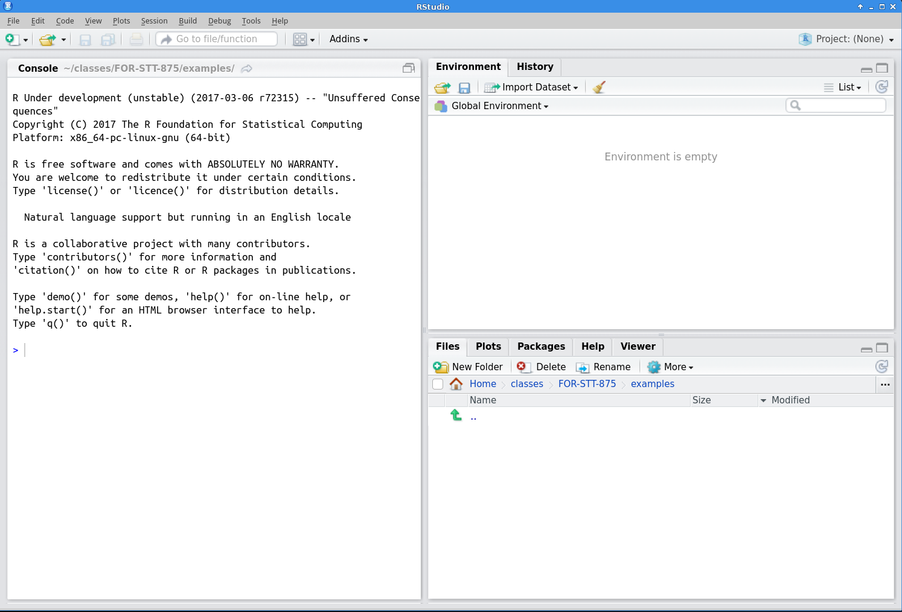

# Introduction to R and RStudio

Various statistical and programming software environments are used in data science, including R, Python, SAS, C++, SPSS, and many others. Each has strengths and weaknesses, and often two or more are used in a single project. This book focuses on R for several reasons:

1. R is free
2. It is one of, if not the, most widely used software environments in data science
3. R is under constant and open development by a diverse and expert core group
4. It has an incredible variety of contributed packages
5. A new user can (relatively) quickly gain enough skills to obtain, manage, and analyze data in R

Several enhanced interfaces for R have been developed. Generally such interfaces are referred to as *integrated development environments (IDE)*. These interfaces are used to facilitate software development. At minimum, an IDE typically consists of a source code editor and build automation tools. We will use the RStudio IDE, which according to its developers "is a powerful productive user interface for R.^[http://www.rstudio.com/]
RStudio is widely used, it is used increasingly in the R community, and it makes learning to use R a bit simpler. Although we will use RStudio, most of what is presented in this book can be accomplished in R (without an added interface) with few or no changes. 

## Obtaining and Installing R

It is simple to install R on computers running Microsoft Windows, macOS, or Linux. For other operating systems users can compile the source code directly.^[Windows, macOS, and Linux users also can compile the source code directly, but for most it is a better idea to install R from already compiled binary distributions.]
Here is a step-by-step guide to installing R for Microsoft Windows.^[New versions of R are released regularly, so the version number in Step 6 might be different from what is listed below.] macOS and Linux users would follow similar steps.

1. Go to http://www.r-project.org/
2. Click on the `CRAN` link on the left side of the page
3. Choose one of the mirrors.^[The http://cran.rstudio.com/ mirror is usually fast. Otherwise choose a mirror in Michigan.]
4. Click on `Download R for Windows`
5. Click on `base`
6. Click on `Download R 3.5.0 for Windows`
7. Install R as you would install any other Windows program

## Obtaining and Installing RStudio

You must install R prior to installing RStudio. RStudio is also simple to install:

1. Go to http://www.rstudio.com
2. Click on the link `RStudio` under the `Products` tab, then select the `Desktop` option
3. Click on the `Desktop` link
4. Choose the `DOWNLOAD RSTUDIO DESKTOP` link in the `Open Source Edition` column
5. On the ensuing page, click on the `Installer` version for your operating system, and once downloaded, install as you would any program

## Using R and RStudio

Start RStudio as you would any other program in your operating system. For example, under Microsoft Windows use the Start Menu or double click on the shortcut on the desktop (if a shortcut was created in the installation process). A (rather small) view of RStudio is displayed in Figure \@ref(fig:rstudio).

```{r rstudio, out.wdith = "4in", out.height = "4in", echo = FALSE, fig.cap = "The Rstudio IDE."}

```

Initially the RStudio window contains three smaller windows. For now our main focus will be the large window on the left, the `Console` window, in which R statements are typed. The next few sections give simple examples of the use of R. In these sections we will focus on small and non-complex data sets, but of course later in the book we will work with much larger and more complex sets of data.  Read these sections at your computer with R running, and enter the R commands there to get comfortable using the R console window and RStudio.

### R as a calculator
R can be used as a calculator. Note that `#` is the comment character in R, so R ignores everything following this character. Also, you will see that R prints `[1]` before the results of each command. Soon we will explain its relevance, but ignore this for now. The command prompt in R is the greater than sign `>`. 

```{r console, prompt=TRUE}
34+20*sqrt(100)  ## +,-,*,/ have the expected meanings
exp(2)  ##The exponential function
log10(100)  ##Base 10 logarithm
log(100)  ##Base e logarithm
10^log10(55)
```

Most functions in R can be applied to vector arguments rather than operating on a single argument at a time. A *vector* is a data structure that contains elements of the same data type (i.e. integers).

```{r vectorized, prompt=TRUE}
1:25 ##The integers from 1 to 25
log(1:25) ##The base e logarithm of these integers
1:25*1:25 ##What will this produce?
1:25*1:5 ##What about this?
seq(from=0, to=1, by=0.1) ##A sequence of numbers from 0 to 1
exp(seq(from=0, to=1, by=0.1)) ##What will this produce?
```

Now the mysterious square bracketed numbers appearing next to the output make sense. R puts the position of the beginning value on a line in square brackets before the line of output. For example if the output has 40 values, and 15 values appear on each line, then the first line will have `[1]` at the left, the second line will have `[16]` to the left, and the third line will have `[31]` to the left.

### Basic descriptive statistics and graphics in R {#sec:dec}
Of course it is easy to compute basic descriptive statistics and to produce standard graphical representations of data. For illustration consider the first 14 observations of tree height and DBH (diameter at breast height) from the FEF data set. We will begin by entering these data "by hand" using the `c()` function, which concatenates its arguments into a vector. For larger data sets we will clearly want an alternative way to enter data.

A style note: R has two widely used methods of assignment: the left arrow, which consists of a less than sign followed immediately by a dash: `<-` and the equals sign: `=`. Much ink has been used debating the relative merits of the two methods, and their subtle differences. Many leading R style guides (e.g., the Google style guide at https://google.github.io/styleguide/Rguide.xml and the Bioconductor style guide at http://www.bioconductor.org/developers/how-to/coding-style/) recommend the left arrow `<-` as an assignment operator, and we will use this throughout the book. 

Also you will see that if a command has not been completed but the ENTER key is pressed, the command prompt changes to a `+` sign.

```{r, prompt=TRUE}
dbh <- c(6, 6.9, 6.4, 6.5, 7.2, 3.1, 2, 4.1, 2.4, 2.7, 3.7, 6.3, 5.2, 5.1, 6.4)
ht <- c(48, 48, 48, 49, 51, 40, 30.5, 50, 28, 40.4, 42.6, 53, 55, 50, 50)
dbh
ht
```

Next we compute some descriptive statistics for the two numeric variables

```{r prompt=T}
mean(dbh)
sd(dbh)
summary(dbh)
mean(ht)
sd(ht)
summary(ht)
```
Next, a scatter plot of `dbh` versus `ht`:
```{r, fig.align= "center"}
plot(dbh, ht)
```

Unsurprisingly as DBH increases, height tends to increase. We'll investigate this further using simple linear regression in the next section.

### Simple linear regression in R
The `lm()` function is used to fit linear models in R, including simple linear regression models. Here it is applied to the DBH height data. 

```{r, prompt=T, fig.align="center"}
ht.lm <- lm(ht ~ dbh) ##Fit the model and save it in ht.lm
summary(ht.lm)  ##Basic summary of the model
plot(dbh, ht) ##Scatter plot of the data
abline(ht.lm) ##Add the fitted regression line to the plot
```
We will work extensively with such models later in the text. We will also talk about why it might not be a good idea to assume a linear relationship between DBH and height---can you guess why this is by looking at the data scatter and model fitted line in the plot above?

## How to Learn

There are several ways to engage with the content of this book and associated learning materials. 

A comprehensive, but slightly overwhelming, cheatsheet for RStudio is available here https://www.rstudio.com/wp-content/uploads/2016/01/rstudio-IDE-cheatsheet.pdf. As we progress in learning R and RStudio, this cheatsheet will become more useful. For now you might use the cheatsheet to locate the various windows and functions identified in the coming chapters.

## Getting help
There are several free (and several not free) ways to get R help when needed. 

Several help-related functions are built into R. If there's a particular R function of interest, such as `log`, `help(log)` or `?log` will bring up a help page for that function. In RStudio the help page is displayed, by default, in the `Help` tab in the lower right window.^[There are ways to change this default behavior.] The function `help.start` opens a window which allows browsing of the online documentation included with R. To use this, type `help.start()` in the console window.^[You may wonder about the parentheses after `help.start`. A user can specify arguments to any R function inside parentheses. For example `log(10)` asks R to return the logarithm of the argument 10. Even if no arguments are needed, R requires empty parentheses at the end of any function name. In fact if you just type the function name without parentheses, R returns the definition of the function. For simple functions this can be illuminating.] The `help.start` function also provides several manuals online and can be a useful interface in addition to the built in help.

Search engines provide another, sometimes more user-friendly, way to receive answers for R questions. A Google search often quickly finds something written by another user who had the same (or a similar) question, or an online tutorial that touches on the question. More specialized is https://rseek.org/, which is a search engine focused specifically on R. Both Google and https://rseek.org are valuable tools, often providing more user-friendly information then R's own help system.

In addition, R users have written many types of contributed documentation. Some of this documentation is available at http://cran.r-project.org/other-docs.html. Of course there are also numerous books covering general and specialized R topics available for purchase.

## Workspace, working directory, and keeping organized

The *workspace* is your R session working environment and includes any objects you create. Recall these objects are listed in the `Global Environment` window. The command `ls()`, which stands for list, will also list all the objects in your workspace (note, this is the same list that is given in the `Global Environment` window). When you close RStudio, a dialog box will ask you if you want to save an image of the current workspace. If you choose to save your workspace, RStudio saves your session objects and information in a `.RData` file (the period makes it a hidden file) in your *working directory*. Next time you start R or RStudio it checks if there is a `.RData` in the working directory, loads it if it exists, and your session continues where you left off. Otherwise R starts with an empty workspace. This leads to the next question---what is a working directory? 

Each R session is associated with a working directory. This is just a directory from which R reads and writes files, e.g., the `.RData` file, data files you want to analyze, or files you want to save. On Mac when you start RStudio it sets the working directory to your home directory (for me that's `/Users/andy`). If you're on a different operating system, you can check where the default working directory is by typing `getwd()` in the console. You can change the default working directory under RStudio's `Global Option` dialog found under the `Tools` dropdown menu. There are multiple ways to change the working directory once an R session is started in RStudio. One method is to click on the `Files` tab in the lower right window and then click the `More` button. Alternatively, you can set the session's working directory using the `setwd()` in the console. For example, on Windows `setwd("C:/Users/andy/for472/exercise1")` will set the working directory to `C:/Users/andy/for472/exercise1`, assuming that file path and directory exist (Note: Windows file path uses a backslash, `\`, but in R the backslash is an escape character, hence specifying file paths in R on Windows uses the forward slash, i.e., `/`). Similarly on Mac you can use `setwd("/Users/andy/for472/exercise1")`. Perhaps the most simple method is to click on the `Session` tab at the top of your screen and click on the `Set Working Directory` option. Later on when we start reading and writing data from our R session, it will be very important that you are able to identify your current working directory and change it if needed. We will revisit this in subsequent chapters.

As with all work, keeping organized is the key to efficiency. It is good practice to have a dedicated directory for each R project or exercise. 

## Quality of R code

```{r comic, echo = FALSE, out.width = "4in", out.height = "4in", fig.cap = "xkcd: Code Quality"}
if (!knitr::is_html_output()) {
  include_graphics("02-introToR/02-images/code_quality.png")
}
```

```{r comic2, echo = FALSE, fig.cap = "xkcd: Code Quality"}
if (knitr::is_html_output()) {
  include_graphics("02-introToR/02-images/code_quality.png")
}
```

Writing well-organized and well-labeled code allows your code to be more easily read and understood by another person. (See xkcd's take on code quality in Figure \@ref(fig:`r if(knitr::is_html_output()) "comic2" else "commic"`).) More importantly, though, your well-written code is more accessible to you hours, days, or even months later. We are hoping that you can use the code you write in this class in future projects and research.

Google provides style guides for many programming languages. You can find the R style guide [here](https://google.github.io/styleguide/Rguide.xml). Below are a few of the key points from the guide that we will use right away.

### Naming Files
File names should be meaningful and end in `.R`. If we write a script that analyzes a certain species distribution: 

+ GOOD: $\color{green}{\verb+african_rhino_distribution.R+}$
+ GOOD: $\color{green}{\verb+africanRhinoDistribution.R+}$ 
+ BAD: $\color{red}{\verb+speciesDist.R+}$ (too ambiguous)
+ BAD:  $\color{red}{\verb+species.dist.R+}$ (too ambiguous and two periods can confuse operating systems' file type auto-detect)
+ BAD:  $\color{red}{\verb+speciesdist.R+}$ (too ambiguous and confusing)


### Naming Variables

+ GOOD: $\color{green}{\verb+rhino.count+}$
+ GOOD: $\color{green}{\verb+rhinoCount+}$
+ GOOD: $\color{green}{\verb+rhino_count+}$ (We don't mind the underscore and use it quite often, although Google's style guide says it's a no-no for some reason)
+ BAD: $\color{red}{\verb+rhinocount+}$ (confusing)

### Syntax

+ Keep code lines under 80 characters long.
+ Indent your code with two spaces. (RStudio does this by default when you press the TAB key.)


